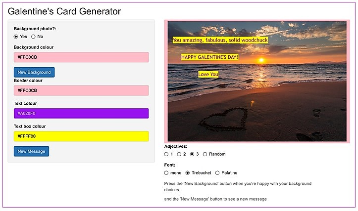

# galentines
Galentines Day Card Generator

Inspired by Leslie Knope of the tv show Parks & Rec, one of my favorite data scientists Maëlle Salmon created a [blog post](http://www.masalmon.eu/2018/01/26/galentinesday/) showing how to make a Galentines Day card in R. I've used her idea and extensively used her code to create a shiny web app so that people can make their own cards.

[The app is at](http://jrwalker.shinyapps.io/GalentinesDayCards/)